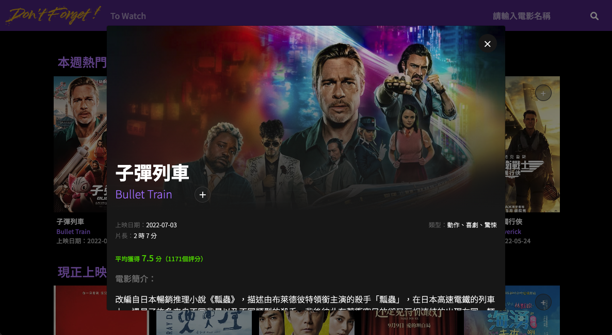
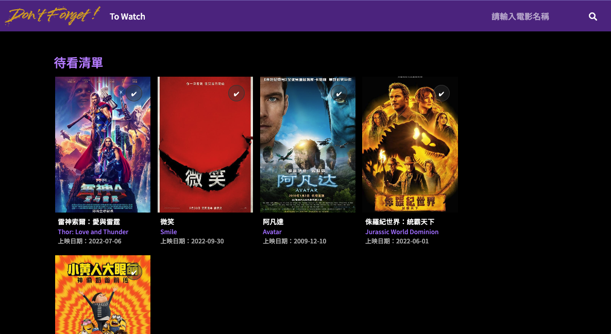
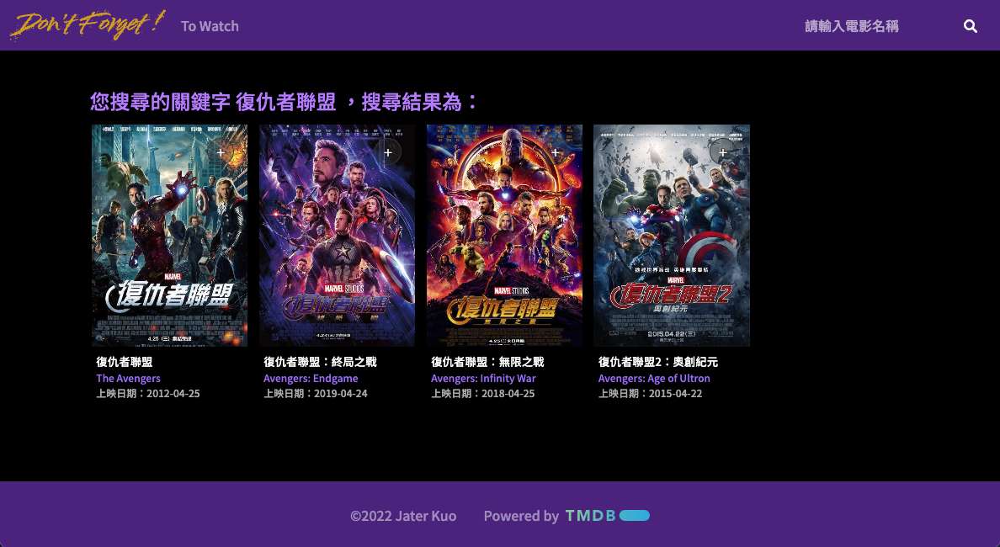

# dont-forget-movies
+ 功能介紹：
  + 練習vue2 的使用
  + 練習串接API
  + 可以將想看的電影加入to watch待看清單中 或移除
  + 點擊某部電影可以查看更多電影資訊
  + 右上角輸入電影標題可以尋找電影

+ GitHub Page :
https://kuochiuhsiang.github.io/dont-forget-movies/

## ScreenShots
  * Home Page
  
  * Modal 
  
  * ToWatch Page
  
  * Search Page
  

## Project setup
```
npm install
```

### Compiles and hot-reloads for development
```
npm run serve
```

### Compiles and minifies for production
```
npm run build
```

### Lints and fixes files
```
npm run lint
```

### Customize configuration
See [Configuration Reference](https://cli.vuejs.org/config/).
